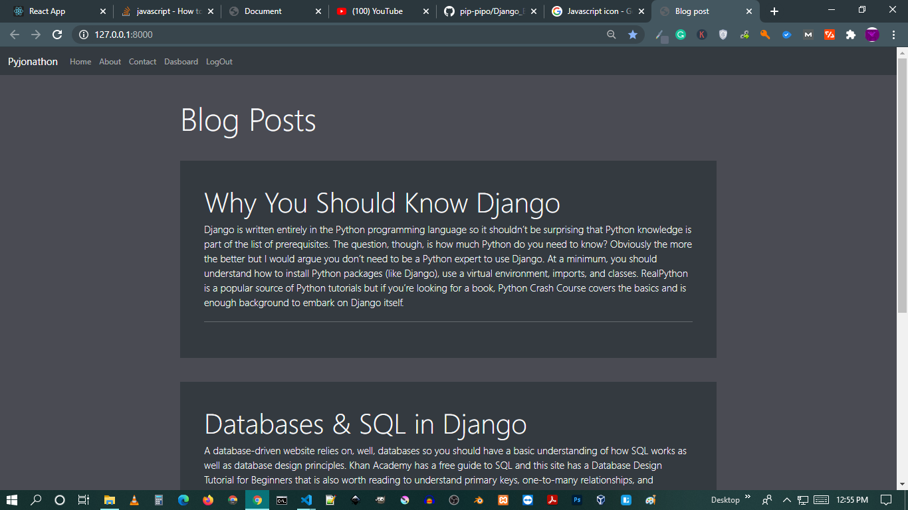
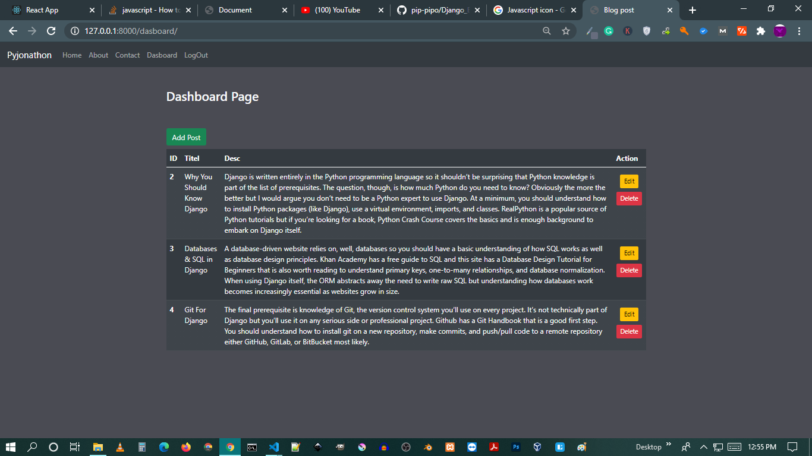
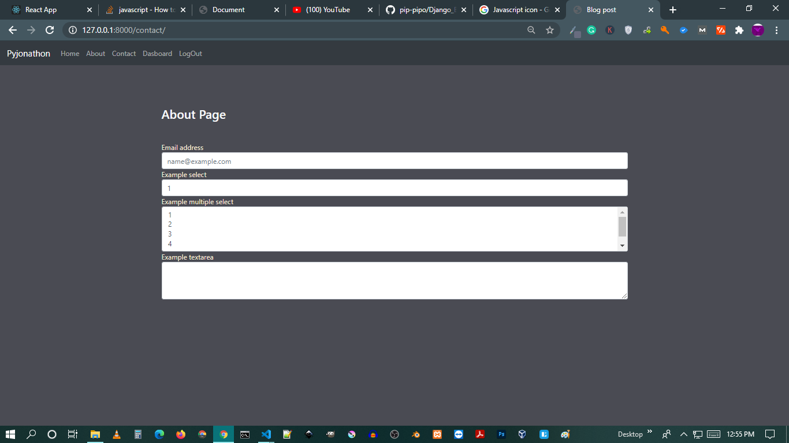
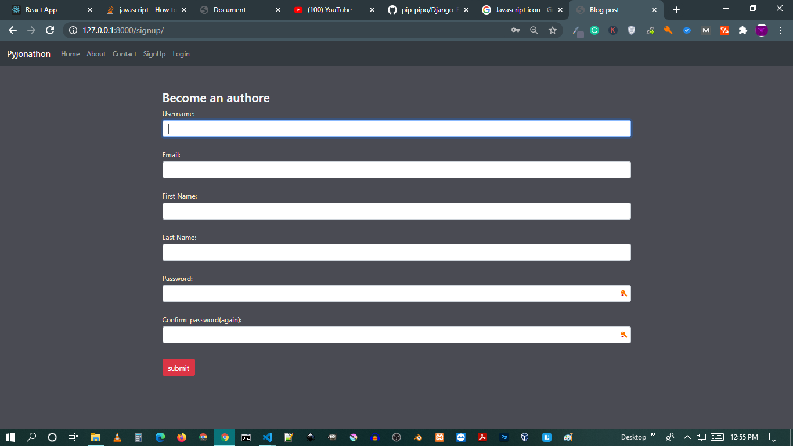
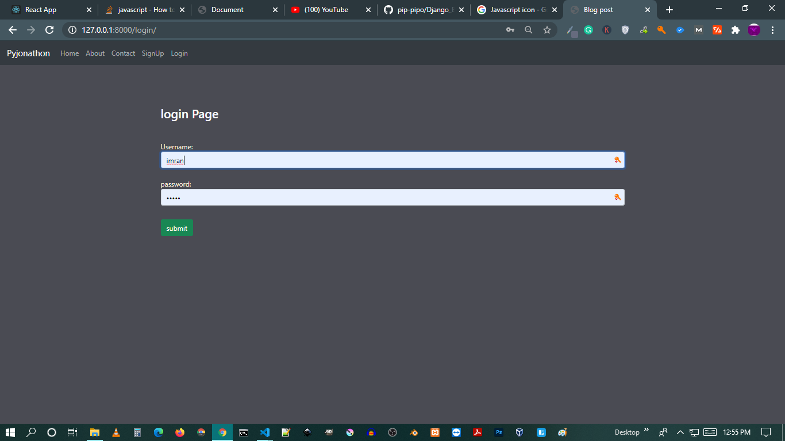
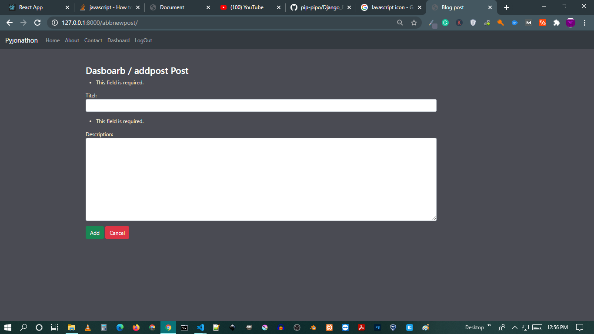

### Django Blog Progect 
Fell free to contribe and make your own changes  .


## Table of contents
- [Table of contents](#table-of-contents)
- [General info](#general-info)
- [Technologies](#technologies)
- [Setup](#setup)
- [*😍 simple Ui Please Contribe to make better](#-simple-ui-please-contribe-to-make-better)

## General info
this project have signup & login ,Logout , system , User model form take Post data and Show data in home ,
	
## Technologies
####
* Django
* bootstrap4
* javascript
* html
* css
## Setup
to run this 

```
$ cd MiniBlog
$ pyhton manage.py runserver
```

#

## *😍 simple Ui Please Contribe to make better









